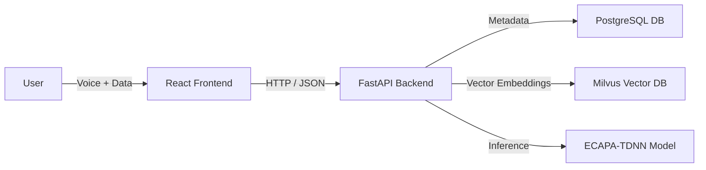

# Bio.VAN - Project Documentation & System Report

**Version:** 1.1.0
**Date:** January 2026
**Author:** Bio.VAN Development Team

---

## 1. Executive Summary

**Bio.VAN** (Biometric Voice Authentication Network) is a next-generation security system that eliminates passwords by using a user's unique voiceprint for identity verification. 

The system employs advanced machine learning (ECAPA-TDNN) to exact high-dimensional vectors (embeddings) from voice samples. It compares these vectors against a secure database to authenticate users with high accuracy, distinguishing between authorized personnel and potential intruders.

The project features a **Cyberpunk/Holographic Frontend** for immersive user interaction and a **Robust Python Backend** for secure data processing.

---

## 2. System Architecture

The application follows a decoupled **Client-Server Architecture**:

### 2.1 High-Level Diagram


### 2.2 Tech Stack

| Component | Technology | Reasoning |
| :--- | :--- | :--- |
| **Frontend** | React, Vite | High performance, component-based architecture for complex UIs. |
| **Styling** | Vanilla CSS (Variables) | Total control over the specific "Neon/Cyberpunk" aesthetic. |
| **Backend** | Python, FastAPI | High-speed Async API, native support for ML libraries (PyTorch). |
| **Database** | PostgreSQL | Relational integrity for user metadata (Name, Email, Role). |
| **Vector DB** | Milvus | Specialized for storing and searching high-dimensional vectors. |
| **AI Model** | SpeechBrain / PyTorch | State-of-the-art speaker recognition models. |

---

## 3. Frontend Implementation Detail

path: `frontend/src`

### 3.1 Design Philosophy: "The Holographic Interface"
We moved away from "boring" corporate designs. The UI simulates a futuristic terminal:
- **Scanlines & CRT Effects**: `index.css` defines global animations.
- **Glassmorphism**: Cards use semi-transparent backgrounds with neon borders.
- **Interactivity**: Elements glow and react to hover states.

### 3.2 Key Components

#### `LoreTerminal.jsx` (New)
*   **Why**: To enhance the immersive "Cyberpunk" narrative and replace static text with dynamic storytelling.
*   **How**: 
    *   Simulates a secure system boot sequence with a typewriter effect.
    *   Displays real-time "dummy" metrics (Latency, Encryption Status, Node Connection) that update dynamically.
    *   Features blinking cursors and neon text styling to match the system's aesthetic.

#### `VoiceRecorder.jsx`
*   **Why**: We needed more than just a "Record" button. Users need visual feedback to know the system is listening.
*   **How**: Uses the Web Audio API to analyze audio frequency in real-time and draws a waveform on an HTML5 Canvas.

#### `VerifyPage.jsx`
*   **Responsiveness**: Recently upgraded to support tablet and mobile layouts.
*   **Stacked Layout**: Automatically switches from a split-pane view to a vertical stack on smaller screens (`< 1024px`), ensuring the terminal log and waveform visualization remain usable on all devices.

#### `EnrollPage.jsx` (The Wizard)
*   **Why**: Enrollment is complex (Metadata + 3 Voice Files). A single long form is overwhelming.
*   **How**: Implemented a "State Machine" wizard:
    1.  **Identity Step**: Validates Email/Name.
    2.  **Calibration Steps (1-3)**: Forces user to read *different* phonetic paragraphs to capture a full range of voice characteristics.
    3.  **Submission**: Aggregates all data into `FormData` and sends it to the API.

#### `ToastContext.jsx`
*   **Why**: Browsers' native `alert()` is ugly and blocks the UI.
*   **How**: A global React Context that renders custom "Holographic Toasts" overlaying the app layer.

---

## 4. Backend Implementation Detail

path: `backend/`

### 4.1 The API (`main.py`)

#### Endpoint: `POST /enroll` (Public Access)
Allows any user to register their voice identity.
*   **Design Choice**: Public enrollment to facilitate easy onboarding, while sensitive admin data remains locked.
*   **Input**: `full_name`, `email`, `role`, `sample_1`, `sample_2`, `sample_3`.
*   **Logic**:
    1.  **Liveness Check**: Before processing, *each* of the 3 samples is analyzed by the spoof detector. If any sample is flagged as synthetic or prerecorded, the entire enrollment is rejected.
    2.  **User Creation**: Creates a record in Postgres.
    3.  **Feature Extraction**: Runs the ECAPA-TDNN model on verified live samples.
    4.  **Vector Averaging**: Computes the **Mean Vector** (centroid) of the three samples to create a robust voiceprint.
    5.  **Storage**: The final 192-dimensional vector is stored in Milvus with `speaker_id = user.id`.

#### Endpoint: `GET /users` (Admin Only)
Strictly protected endpoint to view registered personnel.
*   **Security**: Requires a valid JWT token with `role="admin"`.
*   **Output**: JSON list of all users with status detailed.

#### Endpoint: `POST /verify`
*   **Logic**:
    1.  **Liveness Check**: Mandatory first step. If the sample is not "live", the system returns `verified: False` immediately and logs a `SPOOF_REJECTED` event.
    2.  **Search**: If live, converts audio to vector and queries Milvus using Cosine Similarity.

### 4.2 Database Schema (`postgres_client.py`)
We use SQLAlchemy ORM for type safety.

**Table: `users`**
*   `id` (PK): Links to Milvus ID.
*   `email` (Unique): Prevents duplicate registrations.
*   `role`: Determines access level. `admin` role is required for enrollment operations.

### 4.3 Vector Search (`milvus_client.py`)
*   **Metric**: Cosine Similarity.
*   **Why**: Measures the "angle" between vectors. If the angle is small, the voices are identical.
*   **Threshold**: We interpret the distance score.
    *   `> 0.80`: Identity Verified.
    *   `< 0.80`: Identity Mismatch / Spoof Attempt.

---

## 5. Security & Liveness (Anti-Spoofing)

The system includes a dedicated `liveness_detector` module (`core.anti_spoofing`) to prevent replay and synthesis attacks.

### 5.1 Detection Pipeline
Every audio sample uploaded to the system (Enrollment OR Verification) undergoes this analysis *before* any biometric feature extraction occurs.

1.  **Spectral Analysis**: Analyzes the audio spectrum for artifacts common in recording devices (e.g., lack of high/low frequency data, electrical hum).
2.  **Rejection Logic**:
    *   If `is_live == False`, the request is aborted.
    *   **Audit Logging**: The attempt is logged in the database with the status `SPOOF_REJECTED`, allowing admins to audit potential security breaches.
3.  **Privacy**: As with biometric data, the system relies on processed signal analysis and does not store the raw "attack" audio files permanently.

---

## 6. Setup & User Guide

### 6.1 Prerequisites
*   Node.js (v18+)
*   Python (v3.10+) with `myenv` virtual environment.
*   Docker (for Milvus/Postgres containers).

### 6.2 Running the System
1.  **Start DBs**: `docker-compose up -d`
    *   *Includes Milvus, PostgreSQL, and Attu (Milvus GUI).*
2.  **Start Backend**: 
    ```bash
    cd backend
    ..\myenv\Scripts\activate
    uvicorn api.main:app --reload
    ```
3.  **Start Frontend**:
    ```bash
    cd frontend
    npm run dev
    ```
4.  **Access Database GUI**:
    *   Open `http://localhost:8001` to access **Attu**.
    *   Connect to `milvus:19530` to inspect vector embeddings visually.

### 6.3 Usage
1.  **Initial Setup**: Create an admin user via CLI:
    ```bash
    python backend/scripts/create_admin.py --email admin@test.com --password 123
    ```
2.  **Public Enrollment**: Navigate to `/enroll` to register a new user identity.
3.  **Identity Verification**: Go to `/verify` to test the biometric authentication.
4.  **Admin Dashboard**:
    *   Navigate to `/admin`.
    *   Log in with credentials created in Step 1.
    *   View the secure list of all registered users.

---
*End of Report*
